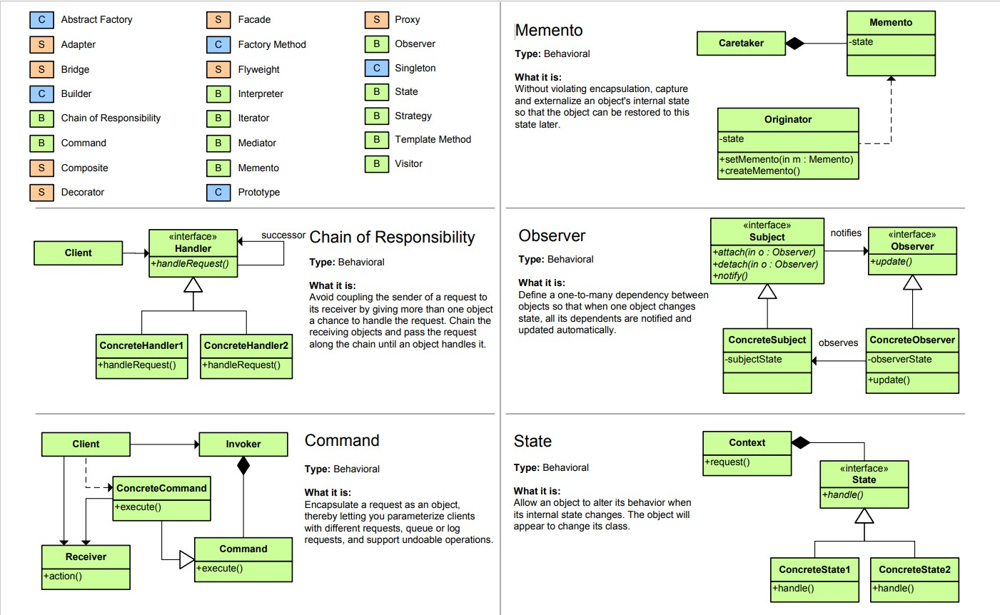
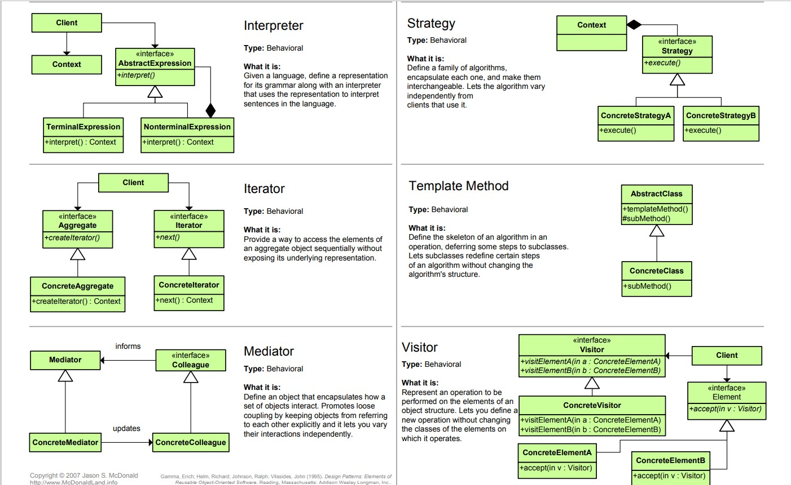
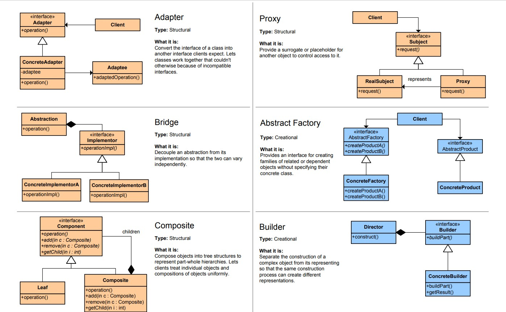
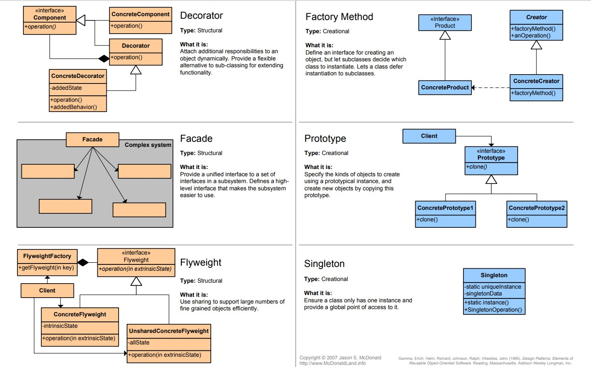

# 深入设计模式

本仓库主要存储经典设计模式的python实现形式以及个人的学习心得与实践思考。   

学习笔记如下:
[深入设计模式笔记](%E6%B7%B1%E5%85%A5%E8%AE%BE%E8%AE%A1%E6%A8%A1%E5%BC%8F%E7%AC%94%E8%AE%B0.md)，里面记载了设计模式的基本概念与十几种设计模式的知识点。  

代码文件的格式如下：

    基本介绍：介绍设计模式的基本概念。
    keyword：介绍代码实现的个人心得。
    最佳抽象：理论化的英文抽象。
    最简实践：个人的具象化实践应用。

## 设计模式结构图

